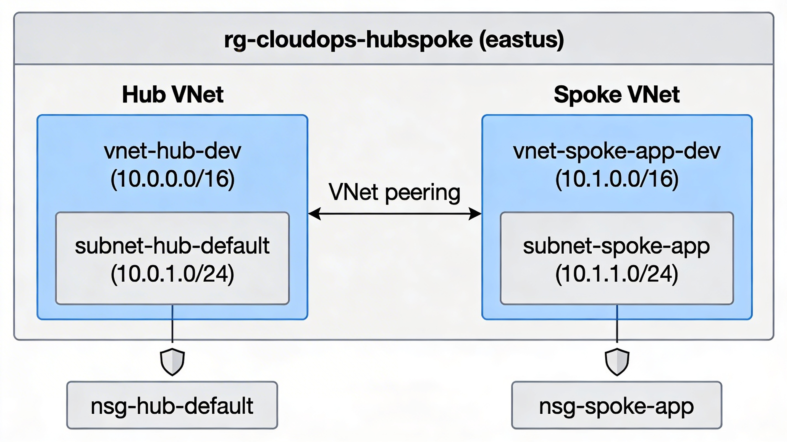
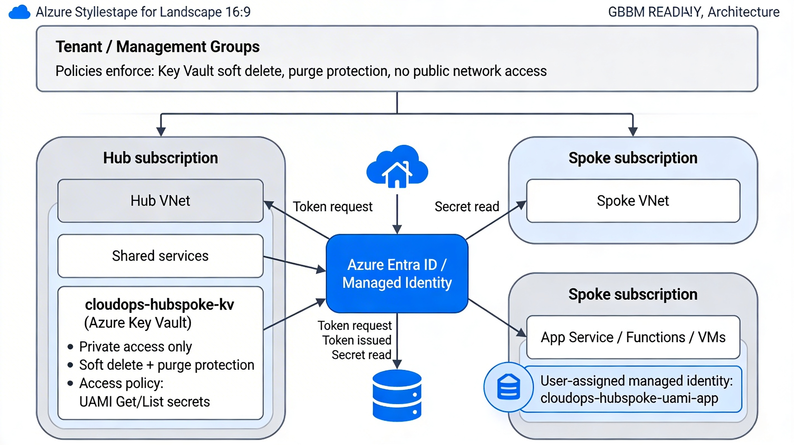
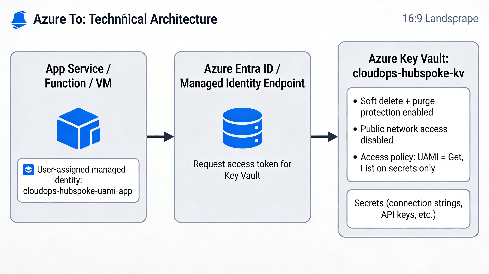

# CloudOps Copilot Landing Zone Tracker

Static progress tracker and reference implementation for a hub-and-spoke Azure landing zone. Roadmap items come from JSON and progress is stored in browser `localStorage`.

## Run locally

Serve from a local web server.

Option 1: VS Code Live Server
1. Open the workspace in VS Code
2. Install the Live Server extension if needed
3. Right-click `index.html` and choose "Open with Live Server"

Option 2: Python
```bash
python -m http.server 5500
```
Then open:
```
http://localhost:5500/index.html
```

Roadmap data: `data/cloudops_landing_zone_tracker.json`

## Milestone 1 - Hub-and-Spoke Network (Completed)

- [x] Terraform scaffolding (`infra/terraform/network`) for AzureRM provider and common tags
- [x] Deployed `rg-cloudops-hubspoke` (eastus) with:
	- Hub VNet `vnet-hub-dev (10.0.0.0/16)` + `subnet-hub-default (10.0.1.0/24)` and `nsg-hub-default`
	- Spoke VNet `vnet-spoke-app-dev (10.1.0.0/16)` + `subnet-spoke-app (10.1.1.0/24)` and `nsg-spoke-app`
	- Bi-directional VNet peering between hub and spoke
- [x] Tags applied on core resources: `project=cloudops-copilot-landing-zone`, `env=dev`, `owner=shane`
- [x] `terraform plan` shows no drift (infra matches code)



## Landing Zone Security Baseline: UAMI + Key Vault

Security baseline for application secrets using Azure Key Vault and a user-assigned managed identity (UAMI).

### IaC implementation notes

- Terraform module creates `cloudops-hubspoke-uami-app` and `cloudops-hubspoke-kv`
- UAMI has only Get/List permissions on secrets via a Key Vault access policy
- Key Vault enforces soft delete, purge protection, and public network access disabled
- Root module exposes outputs (identity IDs, Key Vault name) for spoke/app modules to consume

### What this does

- Centralizes secrets in `cloudops-hubspoke-kv`
- Uses UAMI `cloudops-hubspoke-uami-app` for passwordless auth
- Enforces least privilege (Get/List only)
- Keeps vault protections on (soft delete, purge protection, restricted access)

### How it works (high level)

- Spoke apps use UAMI `cloudops-hubspoke-uami-app`
- App requests a token from Azure Entra ID for Key Vault
- App calls `cloudops-hubspoke-kv` and reads permitted secrets
- Policy baselines can enforce vault protections

Reference diagrams:

- Overall architecture: `docs/cloudops-hubspoke-network-architecture.png`
- Secrets flow: `docs/cloudops-hubspoke-uami-keyvault.png`





## DevSpokeApp – local config + Key Vault wiring

Minimal .NET 8 Web API to test Key Vault + managed identity.

- `/` returns `DevSpokeApp running`
- `/secret` reads `TestSecret` from ASP.NET Core configuration

Locally, `TestSecret` comes from `appsettings.json`. In Azure, the Web App resolves it from `cloudops-hubspoke-kv` via `AddAzureKeyVault` + `DefaultAzureCredential` using a user-assigned managed identity (`AZURE_CLIENT_ID`).

### Local development

```bash
cd "C:\dev\Cloud Infrastructure\src\DevSpokeApp"
dotnet run
```

The app listens on the port from `Properties\launchSettings.json` (currently `http://localhost:5043`).

### Configure TestSecret locally

Create `appsettings.json` in the project root:

```json
{
	"Logging": {
		"LogLevel": {
			"Default": "Information",
			"Microsoft.AspNetCore": "Warning"
		}
	},
	"AllowedHosts": "*",
	"TestSecret": "Hello from appsettings"
}
```

Restart the app:

```bash
dotnet run
```

Browse to `http://localhost:5043/` or `http://localhost:5043/secret`.
